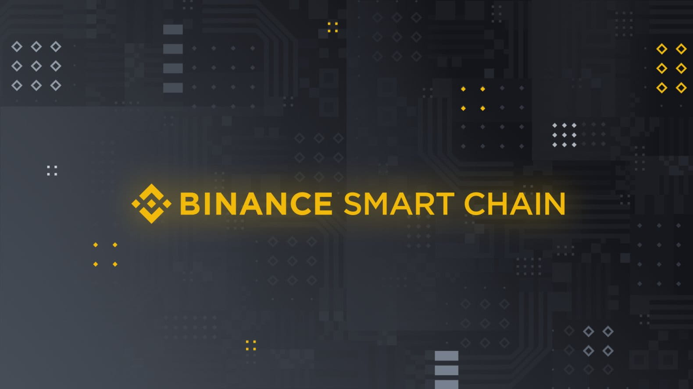

# Giới thiệu về BNB Chain
Binance Chain và Binance Smart Chain (BSC) sẽ trở thành **BNB Chain**. Sự chuyển đổi này làm nổi bật mối liên hệ của BSC với token BNB và hệ sinh thái BNB.

**BNB**, tên viết tắt của “Build and Build” (thường được gọi là Binance Coin), là token gas blockchain “cấp nhiên liệu” cho các giao dịch trên BNB Chain.

BNB Chain bao gồm:
- **BNB Beacon Chain** (Trước là **Binance Chain**) - BNB Chain quản trị (staking, bình chọn)
- **BNB Smart Chain** (BSC) (Trước là **Binance Smart Chain**) - Tương thích EVM, các lớp đồng thuận cùng các hub cho nhiều chuỗi.

Sự kiện thay đổi tên này cũng mang lại thêm nhiều cải tiến giúp đem đến lợi ích cho người dùng, dự án và nhà phát triển kết nối với cộng đồng BNB Chain. BNB Chain sẽ bao gồm các ứng dụng có quy mô lớn, bao gồm GameFi, SocialFi và Metaverse. Thông tin đặc biệt:
- Mở rộng quy mô từ một chuỗi sang nhiều chuỗi 
- Tăng cường thông lượng của BSC
- Giới thiệu cơ chế quản trị trên chuỗi
- Cải thiện các giải pháp mở rộng quy mô và mở rộng validator của BSC từ 21 lên 41 (với 20 validator có chức năng như nhà sản xuất block ứng viên)

BNB Chain vẫn là một hệ sinh thái dựa vào cộng đồng, nguồn mở và phi tập trung. Thông qua khái niệm MetaFi (“Meta” là metadata và “Fi” là DeFi), cộng đồng BNB Chain hướng tới xây dựng cơ sở hạ tầng tạo nền móng cho nền kinh tế ảo song song của thế giới.

## BSC - Binance Smart Chain

### Binance Smart Chain là gì?

Binance Smart Chain viết tắt là BSC được hiểu là một blockchain tiên tiến được cải tiến hơn nhiều so với phiên bản Binance Chain gốc. Nhưng BSC là một nền tảng song song không phải thay thế cho bản cũ. 

BSC sẽ cung cấp đến người dùng các hợp đồng thông minh và cùng khả năng tương thích với Ethereum thông qua EVM. 

### Binance Smart Chain hoạt động như thế nào?

BSC sử dụng thuật toán Proof of Staked Authority (PoSA), là mô hình kết hợp giữa Poof of Authority và Proof of Stake. Trong hệ thống Binance Smart Chain thì những người xác thực vào mạng là những người đã stake một lượng Binance (BNB) nhất định và sau đó nhận phí giao dịch sau khi xác thực các khối được chấp nhận trên mạng này. 

Binance Chain và Binance Smart Chain có thiết kế hoàn toàn đồng bộ và được tích hợp sẵn khả năng tương tích chuỗi chéo giữa 2 hình thức này. Với BSC lượng tài sản có thể được di chuyển nhanh chóng giữa các blockchain nên sẽ kết hợp được khả năng giao dịch tiền mã hoánhanh chóng của bản gốc với chức năng của hợp đồng thông minh ở bản cải tiến. 

Binance Chain có Token BEP-2 và BEP-8 cũng có thể hoán đổi với token BEP-20 của Smart Chain. Người tạo dApp trên các blockchain khác có thể chuyển EVM sang Binance Smart Chain tương đối dễ dàng nhờ khả năng tương thích. 

BSC sẽ rất hấp dẫn các nhà vận hành dApp khi Ethereum không ngừng phát triển và phí GAS sẽ tăng mặc dù kế hoạch chuyển đổi sang mô hình PoS của Etherum trong bản Ethereum 2.0 có khả năng sẽ làm giảm bớt một số lo ngại về quy mô hiện tại. 

### Những ưu điểm chính của Binance Smart Chain

Binance Smart Chain có ưu điểm nổi bật nhất chính là kết hợp những điểm tốt nhất của cả hai công nghệ với nhau. 

Đặc biệt ưu điểm của BSC chính là thời gian sinh ra block ngắn và chi phí giao dịch thấp sẽ hỗ trợ những người dùng mới chuyển đổi tài sản một cách nhanh nhất với chi phí giao dịch thấp. Binance Smart Chain có tính lập trình tương thích với EVM và có khả năng liên lạc liên chuỗi nên sẽ giúp cải thiện hiệu quả làm việc cho các lập trình viên. 

### Ý tưởng thiết lập Binance Smart Chain 
Binance Smart Chain được thiết lập dựa trên những yếu tố đặc biệt dưới đây để đảm bảo tính an toàn nhất cho người dùng:

- BSC là một Blockchain độc lập nên nó mang lại tính bảo mật và sự an toàn đến tất cả người dùng và nhà phát triển. 
- BSC có khả năng tương thích với EVM nên sẽ hỗ trợ được tất cả công cụ hiện có của Ethereum với giao dịch thời gian nhanh và chi phí rẻ hơn.
- Binance Chain cho phép khả năng tương tác giữa 2 blockchain cho phép liên lạc liên Chain và mở rộng quy mô cho các Dapp có năng suất cao với mong muốn sử dụng nhanh và mượt hơn. 

Cuối cùng, khả năng quản trị on chain của Smart Chain thông qua cơ chế đồng thuận PoS và kết hợp với 21 nhà xác thực (validators) giao dịch để mang đến sự phi tập trung và gia tăng khả năng tham gia quyết định của cộng đồng các người dùng. 

### Ai có thể sử dụng Binance Smart Chain?

Binance Smart Chain phục vụ tất cả những lập trình viên, nhất là những dApp có mong muốn xây dựng ứng dụng với tính năng Smart Contract để chú trọng vào tài sản kỹ thuật số có thể giao dịch được. BSC cho phép phát hành token kỹ thuật số và giao dịch dựa trên cả hai chuỗi. 

Do đó, BSC cũng mang đến cơ hội hấp dẫn cho những người đang nắm giữ đồng BNB khi họ có hứng thú đến staking BNB để hỗ trợ quá trình phát triển hệ thống Binance Smart Chain và nhận phần thưởng.

## BEP2 Là Gì?
**BEP2** và **BEP8** là tiêu chuẩn mã thông báo được sử dụng bởi nền tảng BNB. Tiêu chuẩn cung cấp các thông số kỹ thuật để phát hành mã thông báo trên blockchain này. Các giao dịch mã thông báo BEP2 được hỗ trợ bởi nhiều ví phổ biến , chẳng hạn như Trust Wallet, ví Ledger và Trezor Model T. Nếu bạn muốn giao dịch bằng mã thông báo BEP2, bạn sẽ cần sử dụng đồng BNB để thanh toán Gas , tức là phí giao dịch.

Một lợi thế của BEP2 là sự thuận tiện khi giao dịch giữa các loại tiền điện tử khác nhau ở định dạng trao đổi phi tập trung (DEX) . Tuy nhiên, BEP2 không hỗ trợ các hợp đồng thông minh , mà nhiều mã thông báo và DApp dựa vào cho chức năng của chúng.

## BEP20 Là Gì?
Blockchain mới được thiết kế để tương thích với Máy ảo Ethereum ( EVM ), nền tảng của Ethereum để phát triển các hợp đồng thông minh. BEP20 là tiêu chuẩn mã thông báo được sử dụng bởi BSC và là một tiêu chuẩn đa năng được thiết kế để tương thích với cả BEP2 và ERC20 của Ethereum.

BEP20 và BSC đã mở ra cơ hội cho người dùng tiếp cận với số lượng lớn và ngày càng tăng nhanh chóng của DApp. Trong vòng vài tháng sau khi ra mắt, BSC đã trở thành đối thủ chính đối với Ethereum để phát triển DApp được mã hóa.

Tương tự như BEP2, giao dịch bằng mã thông báo BEP20 yêu cầu tiền BNB để trả tiền gas. BEP20 hiện được hỗ trợ bởi tám ví , bao gồm Ví Arkane và Ví Toán học. Bạn cũng có thể giao dịch giữa BEP2n và BEP20 bằng “Bridge”. Đây là một dịch vụ chuỗi chéo được thiết kế để tạo điều kiện cho khả năng tương tác giữa một số blockchain, bao gồm Ethereum và TRON ( TRX ).

## Sự Khác Biệt Giữa BEP2 Và BEP20
BEP20 được tạo ra như một đặc điểm kỹ thuật cho Binance Smart Chain, với mục tiêu cung cấp một định dạng linh hoạt cho các nhà phát triển để khởi chạy một loạt các dự án token khác nhau. Chúng có thể đại diện cho bất kỳ thứ gì từ cổ phiếu trong một doanh nghiệp đến đô la được lưu trữ trong kho bạc ngân hàng (VD: stablecoin).

Giống như token BEP2 trên Binance Chain, việc chuyển token BEP20 được xác nhận bằng đồng coin BNB. Đó là lý do cho những người xác thực bao gồm các giao dịch trong blockchain, vì họ sẽ nhận được BNB như một khoản phí cho việc xác thực của họ.

Binance Smart Chain (BSC) được hình dung như một nền tảng mở rộng cho Binance Chain. Với kiến ​​trúc chuỗi kép, cả hai chuỗi đều bổ sung cho nhau. Binance Smart Chain phục vụ các ứng dụng phi tập trung mà không làm nghẽn chuỗi ban đầu, được tối ưu hóa cho tốc độ giao dịch nhanh chóng.

## Địa Chỉ Ví Của BEP20 Và BEP2 Là Gì?
Các ví tiêu chuẩn khác nhau sẽ có dạng địa chỉ khác nhau. Cụ thể:

- Địa chỉ ví BEP2 trên Binance Chain có dạng: bnb136ns6lfw4zs5hg4n85vdthaad7hq5m4gtkgf23
- Địa chỉ của ví BEP20 và ERC20 có dạng: 0xa0528e7dd766e0ad81cef230858df07b0dfe1ac8
- Địa chỉ ví TRC20 thì có dạng: TAra6JMLy95khZRPcuqYW2hrUqCZafn39p
Vậy là bạn đã hiểu được khái quát các tiêu chuẩn chung của các token cũng như phân biệt được sự khác nhau giữa BEP20 và BEP2. Hi vọng bài viết này đã giải quyết phần nào những thắc mắc của các bạn trong thị trường crypto.

## BEP8 là gì?
BEP8 là một loại mã thông báo đặc biệt còn được gọi là “mini-token”, đánh dấu một cột mốc quan trọng trong việc nâng cao tiềm năng của Binance Chain. Giao thức mã thông báo BEP8 phù hợp với các dự án nhỏ, đầy hứa hẹn nhưng không có đủ chi phí để phát hành mã thông báo BEP2 trong hiện tại.

So với mã thông báo BEP2, việc phát hành và niêm yết mã thông báo BEP8 thuận tiện và hợp lý hơn. Người dùng có thể chi tiêu ít nhất là 3 BNB để tạo mã thông báo BEP8. Cách thức hoạt động của mini-token có thể được so sánh với các hội đồng quản trị doanh nghiệp vừa và nhỏ (SME) trên thị trường chứng khoán truyền thống.

Mã thông báo BEP8 cũng cung cấp các tính năng sau:

- Các khả năng trường hợp sử dụng blockchain hấp dẫn trong các lĩnh vực như tài chính vi mô, mã hóa bản quyền, khuyến khích cộng đồng…
- Niêm yết trực tiếp với BNB và / hoặc BUSD mà không cần trải qua quá trình bỏ phiếu của người xác nhận.
- Cơ hội được nâng lên thành mã thông báo BEP2 khi mã thông báo nhỏ có đủ thanh khoản và thời gian đáo hạn.