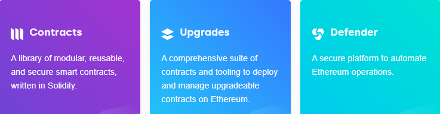
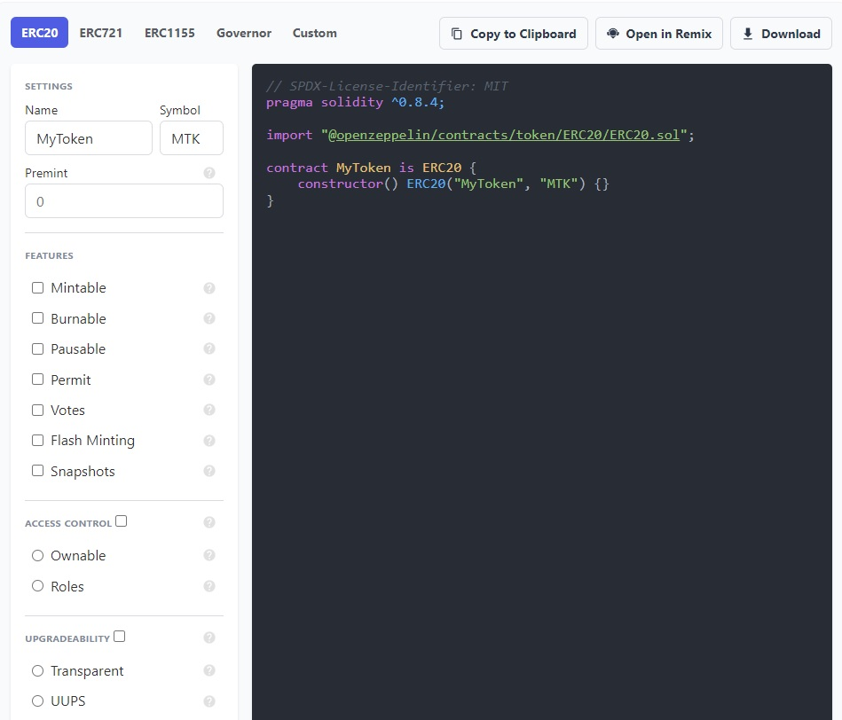

# Giới thiệu về Framework Open Zeppelin

Sự bùng nổ của công nghệ block chain cũng như ứng dụng phi tập trung (DApp) hiện nay đem lại nhiều lợi ích cũng như đột phá trong nhiều lĩnh vực. 
Tuy nhiên việc phát triển nhanh và cộng đồng tham gia lớn dẫn tới việc các ứng dụng phi tập trung dần lộ ra những vi phạm về bảo mật mà từ đó kẻ xấu có thể tấn công và gây thiệt hại cho tổ chức hoặc cá nhân sở hữu nền tảng/ứng dụng.

Để giải quyết các vấn đề về bảo mật nêu trên thì **Open Zeppelin** đã ra đời

## Ai đang sử dụng OpenZeppelin
- Các công ty, nhà phát triển các dự án dựa trên nền tảng block chain.
- Nhiều tổ chức lớn, đang chú ý nhất là **Ethereum Foundation** và **Coinbase**.

## What - OpenZeppelin là gì
- OpenZeppelin là một **nền tảng (framework) mã nguồn mở** để xây dựng các dApp an toàn. Framework cung cấp các công cụ cần thiết để tạo và tự động hóa các ứng dụng Web3.

## Why - Tạo sao nên sử dụng OpenZeppelin
- Cộng đồng lớn mạnh, bao gồm cả các tổ chức quy mô lớn
- Các dịch vụ đã được cộng đồng công nhận và kiểm duyệt.  
- Khi cài đặt OpenZeppelin, có thể sử dụng các hợp đồng đã được kiểm duyệt của nó trong nhiều dự án Ethereum khác nhau. 
Các trường hợp sử dụng ví dụ OpenZeppelin bao gồm nhưng không giới hạn các mục sau:
  + **Hạn chế quyền truy cập(Access Restriction)**:
    Kiểm soát quyền truy cập là một trong những trường hợp sử dụng chính của OpenZeppelin. Hợp đồng này cho phép bạn xác định ai có thể truy cập các tài nguyên và chức năng cụ thể trong hệ thống. Nhờ khả năng này, bạn có thể hạn chế bỏ phiếu, đúc tiền, gửi giao dịch, v.v. cho các thực thể cụ thể.
  + **Quyền sở hữu (Ownership)**:
    “Có thể sở hữu” là một hợp đồng OpenZeppelin khác, trong đó bạn có thể xác định quyền sở hữu trong các hợp đồng. Nói cách khác, việc triển khai hợp đồng này sẽ giúp các thực thể cụ thể có được những khả năng nhất định. Sử dụng tiện ích mở rộng cho hợp đồng cơ sở, bạn cũng có thể chuyển quyền sở hữu từ tài khoản này sang tài khoản khác. Nhờ một phần mở rộng khác đối với hợp đồng này, bạn có thể từ bỏ quyền sở hữu trước đó.
  + **Tính toán (Calculations)** - “SafeMath” là một hợp đồng OpenZeppelin hữu ích giúp thực hiện các phép tính chính xác và chính xác. Thư viện này đặc biệt hữu ích để ngăn chặn tràn hoạt động khi mã hóa trong Solidity. Tình huống xảy ra khi giá trị trong một phép toán số học nhất định không nằm trong phạm vi cho phép.
  + **Mã thông báo (Tokens)** - OpenZeppelin đã tạo cơ sở hạ tầng cần thiết cho các nhà phát triển để tạo mã thông báo có thể giao dịch và phân bổ chúng cho những người tham gia trong mạng của bạn. Sử dụng hợp đồng này, bạn có thể theo dõi giá, chỉ định phương thức chuyển mã thông báo, xác thực giao dịch mua và hơn thế nữa.
  + **Thanh toán (Payments)** - Bạn có đang phát triển một dApp với nhiều người thụ hưởng khác nhau không? Sử dụng hợp đồng OpenZeppelin “PaymentSplitter”, bạn có thể gửi thu nhập từ các giao dịch mua dApp của mình cho các bên khác nhau.
  + **Gas Station Network** - Hợp đồng này giúp bạn phát triển các dApp trong đó bạn sẽ thanh toán thay mặt cho người dùng của mình. Trong phương pháp này, người dùng không cần giữ ETH trong ví của họ và thay vào đó bạn sẽ thanh toán cho chúng.

## Products - Các dịch vụ OpenZeppelin cung cấp 
Một số công cụ nổi bật của OpenZeppelin:

  
**Contracts**: 
  + **Là thư viện các hợp đồng thông minh được viết bằng Solidity** cho Ethereum và các DLTs (công nghệ sổ cái phân tán) khác.
  + Bao gồm cả các hợp đồng thông minh có thể nâng cấp.
  + Các hợp đồng này **đã được cộng đồng xem xét và kiểm duyệt** như các tiêu chuẩn an toàn để phát triển dApps.
  + **Hoàn toàn theo mô-đun, có thể tái sử dụng và hầu hết dựa theo tiêu chuẩn kỹ thuật ERC** (Ethereum Request for Comments).
  + Công cụ trực tuyến **Contracts Wizard** giúp khởi tạo các hợp đồng thông minh một cách trực quan (Tham khảo tại https://docs.openzeppelin.com/contracts/4.x/wizard)  
  
  => Điều này có nghĩa là các công ty/cá nhân không cần phải phát triển các tính năng và công cụ bảo mật cho các smart contracts. Thay vào đó tập trung vào việc triển khai các hợp đồng thông minh dựa trên gói có sẵn trong thư viện của OpenZeppelin.

**Upgrades**: 
  + Là bộ công cụ để **triển khai và bảo vệ** các hợp đồng thông minh **có thể nâng cấp**. 
    Các plugin **có thể tích hợp thẳng vào quy trình có sẵn** dành cho Hardhat và Truffle để triển khai và quản lý các hợp đồng có thể nâng cấp trên Ethereum. 
    Các tính năng chính của gói plugins bao gồm: 
    * Triển khai các hợp đồng có thể nâng cấp.
    * Nâng cấp các hợp đồng đã triển khai.
    * Quản lý quyền quản trị proxy.
    * Dễ dàng sử dụng trong các bài kiểm tra.

**Defender**: 
  + OpenZeppelin Defender **cung cấp nền tảng hoạt động bảo mật** (SecOps) cho Ethereum với các phương pháp tối ưu nhất được tích hợp sẵn giúp **vận chuyển nhanh hơn và giảm thiểu rủi ro bảo mật**.
  + **Defender Admin**: Là công cụ trực tuyến cho phép các nhà phát triển thực hiện và tự động hóa các hoạt động của hợp đồng thông minh một cách an toàn (Tham khảo tại https://www.openzeppelin.com/defender?utm_campaign=Defender&utm_source=docs&utm_content=oz).
    Defender cung cấp các tính năng:
    * Admin: Giúp tự động hóa và bảo mật tất cả các hoạt động hợp đồng thông minh của bạn, chẳng hạn như kiểm soát truy cập, nâng cấp và tạm dừng
    * Relay: Giúp xây dựng cơ sở hạ tầng giao dịch cá nhân và an toàn bằng việc triển khai các trình chuyển tiếp private
    * Autotasks: Giúp tạo các tập code tự động để tương tác với các hợp đồng thông minh
    * Sentinel: Giúp theo dõi các sự kiện, chức năng và giao dịch trong hợp đồng thông minh và nhận thông báo qua email
    * Advisor: Giúp tìm hiểu và thực hiện các phương pháp hay nhất về phát triển, kiểm tra, giám sát và vận hành

