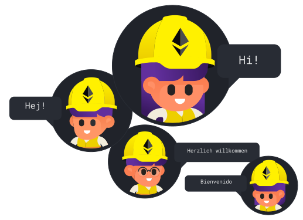

# Language & Framework

## Language
Có rất nhiều ngôn ngữ lập trình có thể được sử dụng để phát triển smart contract, tuy nhiên ở đây chúng ta tập trung vào Solidity nhé các bạn.

## Frameworks
Là một developer, bạn luôn phải lựa chọn một framework hoặc một môi trường (environment) cung cấp cho bạn các tùy chọn tốt nhất để phát triển phần mềm và khi bạn lập trình Blockchain điều đó cũng như vậy. Chúng ta có một số tùy chọn như Truffle, Hardhat, Brownie, Embark, v.v. Tuy nhiên, hiện tại chúng ta sẽ chỉ tập trung vào Truffle và Hardhat mà thôi.

Với những bạn mới bắt đầu tìm hiểu Ethereum nói riêng cũng như các nền tảng EVM-based nói chung đều biết đến **Truffle** (một framework hỗ trợ compile, deploy smart contract). Tuy nhiên, khi cần phát triển các smart contract lớn, phức tạp hơn thì nó sẽ bộc lộ 1 số hạn chế như tốn nhiều gas, thời gian deploy lâu, … Với **Hardhat**, framework đem lại cho chúng ta những tùy chọn, tính năng phần nào vượt trội hơn để làm với các hệ thống smart contract phức tạp hơn.

Sau đây thì chúng ta sẽ đi chi tiết vào **Hardhat** hơn Truffle nhé ae.

### Hardhat
Cũng như Truffle, Hardhat là một môi trường phát triển để biên dịch, triển khai, test và debug Dapp Ethereum.

Một số điểm tính năng nổi bật của Hardhat

Tích hợp mạng local hardhat, dễ dàng chạy và debug code ngay trên local.
Debug dễ dàng hơn: Với Hardhat, chúng ta có thể debug code Solidity dễ dàng hơn khi có thể **console.log** ra các biến (Solidity vốn ko hỗ trợ console.log)
Hệ thống plugin: Giúp developer có thể bổ sung chức năng, tùy vào từng dự án cụ thể
Hỗ trợ **TypeScript**

