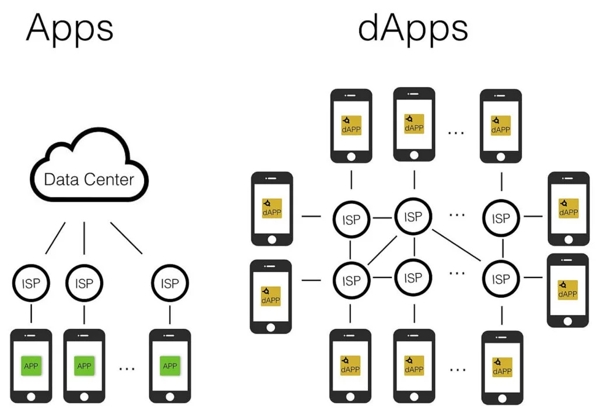
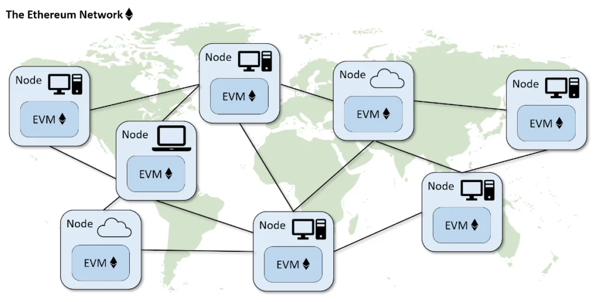

# Giới thiệu về Dapp

**DApp** là viết tắt của **Decentralized Application**, tức Ứng dụng phi tập trung hay còn gọi là **Ứng dụng phân quyền**. DApp là một ứng dụng phần mềm chạy trên một mạng phân tán. Nó không được lưu trữ trên một máy chủ tập trung mà thay vào đó là một mạng phi tập trung ngang hàng. Dapp cũng giống như bất kỳ ứng dụng phần mềm nào khác mà bạn sử dụng. Nó có thể là một trang web hoặc một ứng dụng trên điện thoại của bạn. **Điều làm cho Dapp khác với một ứng dụng truyền thống là nó được xây dựng trên một mạng phi tập trung như Ethereum.**

Khi bạn tạo các hợp đồng thông minh Ethereum, tức là bạn viết một đoạn code backend cho Dapp. Và trong khi Dapp của bạn sẽ có giao diện người dùng giống như một ứng dụng truyền thống, tất cả hoặc một phần của backend được xây dựng trên Ethereum. Chúng ta có thể hiểu:

**Dapp = frontend + smart contract backend**

Sự phát triển của Dapps có thể coi là một bước tiến hướng tới một tương lai của Internet và có thể gọi là Web 3.0.

## Tại sao lại là Ethereum?
Câu hỏi đặt ra là tại sao lại là Ethereum? Có phải Ethereum là giao thức duy nhất để xây dựng nên các dApps? Câu trả lời là KHÔNG. Có những giao thức khác được sử dụng để xây dựng Dapp, như EOS, NEO, Stellar, Tron và Cardano, nhưng giao thức phổ biến nhất là Ethereum.

Ethereum là một giao thức mạng (network protocol) cho phép người dùng tạo và chạy các hợp đồng thông minh qua một mạng phi tập trung. Hợp đồng thông minh chứa code chạy các hoạt động (operation) cụ thể và tương tác với các hợp đồng thông minh khác và code này được viết bởi các nhà phát triển. Không giống như Bitcoin lưu trữ một số (number), Ethereum lưu trữ mã thực thi (executable code).

Ethereum loại bỏ sự cần thiết của bên thứ ba để xử lý các giao dịch giữa các đồng cấp (peers). Kể từ khi người trung gian được thay thế bằng code, tất cả các loại chi phí được giảm bớt, kể cả thời gian và tiền bạc. Giống như Bitcoin loại bỏ nhu cầu ai đó giữ tiền của bạn, Ethereum loại bỏ sự cần thiết phải có người môi giới giao dịch.

Bây giờ bạn có thể tự hỏi, tất cả các hợp đồng thông minh này ở đâu? Về cơ bản, chúng được lưu trữ trên nhiều node máy tính trên toàn thế giới. Các node này chứa tất cả thông tin của tất cả các hợp đồng thông minh trên thế giới, bao gồm mã, giao dịch, v.v. Chúng hoạt động liên tục để cập nhật thông tin, đảm bảo tất cả chúng đều có cùng một bản sao. Đây là điều khiến các hợp đồng thông minh và tiền điện tử nói chung trở nên phi tập trung.

Và vì tất cả các node đều có thông tin giống nhau và được phổ biến trên toàn thế giới, nên việc loại bỏ một node sẽ không làm gián đoạn việc thực hiện bất kỳ hợp đồng thông minh nào, đảm bảo thời gian hoạt động là cao nhất.

## Đặc điểm của DAPPs
Các DAPP thường có các đặc điểm sau:

- Chúng chạy trên blockchain
- Code của chúng được tạo thành mã nguồn mở hoạt động độc lập mà không cần bất kỳ cá nhân hoặc nhóm nào kiểm soát phần lớn các token
- Chúng tạo ra các DAPP tokens để cung cấp giá trị cho các nodes (contributing nodes)
- Người dùng được cấp quyền truy cập vào chúng để trao đổi token
- Những người khai thác được thưởng bằng token khi họ đóng góp thành công vào hệ sinh thái

## Các loại DAPP
Ethereum mô tả ba danh mục chính của DAPP:

- **1. Ứng dụng quản lý tiền:** người dùng có thể giao dịch với nhau trên mạng blockchain, sử dụng tiền tệ nội tại của nó. Các DAPP này thường có các blockchain riêng và chúng ta thường gọi chúng là tiền điện tử (chẳng hạn như Bitcoin).

- **2. Các ứng dụng tích hợp tiền với các sự kiện bên ngoài, trong thế giới thực:** ví dụ: một công ty hậu cần có thể sử dụng vị trí chip RFID để xác định rằng một lô hàng đã đến cảng, và chỉ sau đó thanh toán cho lô hàng đó. Điều này thậm chí có thể được thực hiện bằng tiền trên blockchain mà không có sự can thiệp của con người, nếu cả người mua và người bán tham gia vào một hợp đồng thông minh.

- **3. Các tổ chức tự trị phi tập trung (Decentralized Autonomous Organizations – DAO):** các tổ chức phi tập trung, không có người lãnh đạo trên blockchain. Những quy tắc này bắt đầu từ quan niệm theo các quy tắc được lập trình xác định về những thực thể nào có thể là thành viên, cách các thành viên có thể bỏ phiếu, những doanh nghiệp hoặc hoạt động nào họ có thể tham gia và cách trao đổi token, quỹ (fund) hoặc giá trị. Sau khi được triển khai, DAPPs hoạt động tự chủ theo các quy tắc của chúng. Các thành viên có thể phân tán  ở bất cứ đâu về mặt địa lý.

Cho đến nay, các công ty khởi nghiệp DAPP (được xây dựng trên các nền tảng blockchain) đã tạo nên phần lớn các ICO. Hầu hết các DAPP Loại 2 và Loại 3 hiện tại đều sử dụng nền tảng Ethereum.
